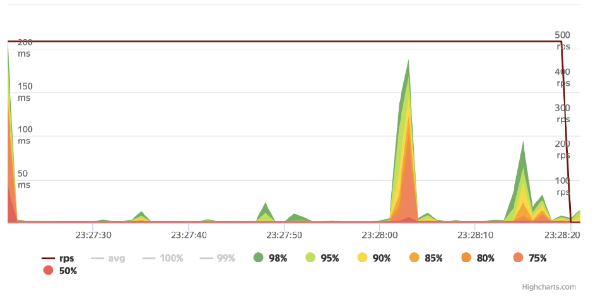
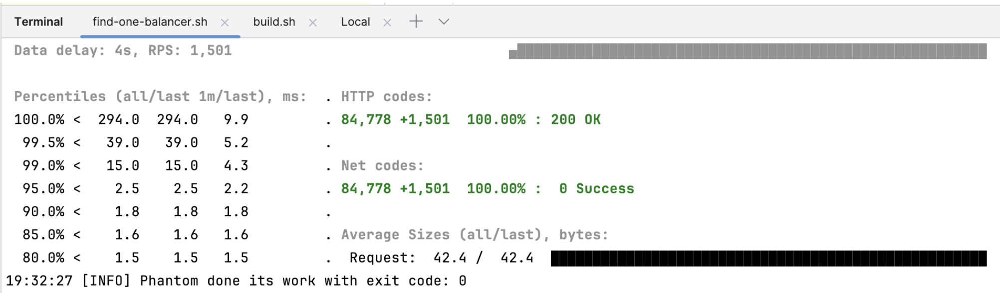
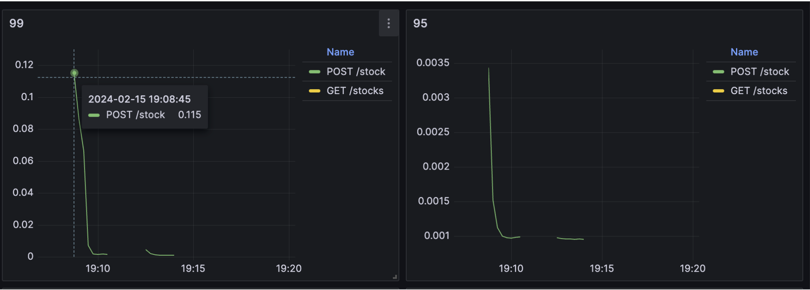

## Load test with Yandex tank and ghz
### version 3.1.0

### It's a simple example, I highly recommend refactoring this example for using in production aria.

What do we need to install:
1. docker desktop 
2. python for yandex tank
3. ghz

--- 

# Yandex tank

Read more about:
[ya docs link](https://yandextank.readthedocs.io/en/latest/)

Go to the folder:
```shell
cd yandex_tank
```

### load folder
1. _demo_ has a simple example for basic configuration
```yaml
phantom: # base engine
  address: "localhost" # our address
  port: "8085" # port for service
  load_profile: # part of config which responsible for load process
    load_type: rps 
    schedule: const(1500, 60s) # we can change the type, ex: rate, const
  writelog: all # for all logs
  ssl: false # if we have localhost we don't need ssl
  uris: # for get request we can use just the sections below
    - "/api/v1/stocks"
telegraf: # extra monitoring
  enabled: false
autostop: # autostop rule can help us to stop the test if we have problems
  autostop:
    - time(500ms,1s) # if request average > 1s
    - http(5xx,3%,1s) # if 500 errors > 1s
    - http(4xx,3%,1s) # if 400 > 3%
    - net(xx,25,10) # if amount of non-zero net-codes in every second of last 10s period is more than 25 
```
2. _env_ for token, we can find it here: https://overload.yandex.net


3. _run_ test with sh script

I added runners for all cases. We can choose best one.  
_-...load_ -> to 8085  
_-...balancer_ -> to nginx



4. ammo generator
Python script which can create ammo for tank. Used simple generator, like here: [ammo generator example Yandex Tank docs](https://yandextank.readthedocs.io/en/latest/ammo_generators.html)
```python
# code: 
def generate_json(): # I just use simple case ;D
    body = { 
        "name": "content",
        "price": 1,
        "description": "description"
    }
    url = "/api/v1/stock"
    h = headers + "Content-type: application/json"
    s1 = json.dumps(body)
    ammo = make_ammo(method, url, h, case, s1)
    sys.stdout.write(ammo)
    f2 = open("ammo/ammo-json.txt", "w")
    f2.write(ammo)
```
We can generate ammo file:
```text
212 
POST /api/v1/stock HTTP/1.1
Host: test.com
User-Agent: tank
Accept: */*
Connection: Close
Content-type: application/json
Content-Length: 61

{"name": "content", "price": 1, "description": "description"}

```
We shouldn't add anything here, because we generated it.


Read more:  
Yandex tank [ya link](https://yandextank.readthedocs.io/en/latest/)  
If you cannot use Docker check more information about settings here: [download and install](https://yandextank.readthedocs.io/en/latest/install.html#installation-from-pypi)  
How can you change it or overwrite? First, read documentation here [Yandex load file docs](https://yandextank.readthedocs.io/en/latest/tutorial.html)  
Use as standalone [install with pip3](https://yandextank.readthedocs.io/en/latest/install.html#installation-from-pypi)  
Yaml settings: [here](https://yandextank.readthedocs.io/en/latest/core_and_modules.html#load-generators)  
Jmeter [here](https://gist.github.com/sameoldmadness/9abeef4c2125bc760ba2f09ee1150330)  

---
# ghz
Read more here: [ghz](https://ghz.sh)  

just install it [docs](https://ghz.sh/docs/install)
```shell
brew install ghz
```
config:
```shell
cd .. && cd stock-grpc-service/proto

ghz --insecure \
  --proto ./stocks.proto \
  --call stocks.StocksService.Save \
  -d '{"stocks": { "name":"APPL", "price": "1.3", "description": "apple stocks"} }' \
  -n 2000 \
  -c 20 \
  --connections=10 \
  0.0.0.0:5007
```

---
# Services

Stock-service has prometheus and actuator, we can use it for integration with grafana.  
example: http://localhost:8084/actuator/prometheus

```yaml
global:
  scrape_interval:     5s
  evaluation_interval: 5s

scrape_configs:
  - job_name: prometheus
    static_configs:
      - targets: ['localhost:9090']
  - job_name: stock-service-1
    metrics_path: /actuator/prometheus # http://localhost:8084/actuator/prometheus
    static_configs:
      - targets: ['stock-service-1:8084']
```

Grafana board folder has a board.json file, we can use for visualisation.  
Example:  
